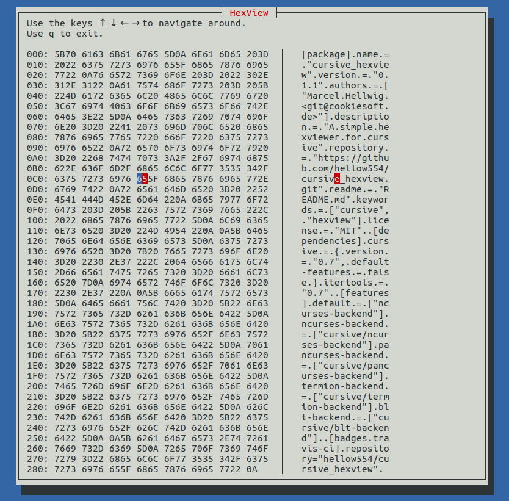

Cursive-Hexview
===============

[](https://travis-ci.org/hellow554/cursive_hexview)
[](./LICENSE)

A simple and basic hexviewer which can be used with [cursive][0].


Usage
-----

Just put this into your `Cargo.toml`

```toml
[dependencies]
cursive_hexview = "0.1"
```

and this in your rust code.

```rust
extern crate cursive_hexview;
```


For a minimal example see `examples` folder.




[0]: https://crates.io/crates/cursive
